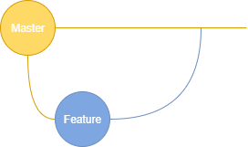

# Source Code Management

In this part, we need to choose the right branching strategy for the project. First, we searched the theory and how to choose it, and then we chose the branch mode.

Source code management [1] (SCM), or Version control, is used to track modifications to a source code repository. SCM tracks a running history of changes to a code base and helps resolve conflicts when merging updates from multiple contributors.

## Git branching model

First, is useful to get concepts like:

* **Trunk-based development:** Trunk-based development [2] is a branching model that is also referred to as “mainline development.” All branches extend from one trunk/main branch, usually called the master branch. This persistent branch is where all developers commit. The master branch follows the evolution of a software project.

* **Feature-driven development:** Feature-driven development [2] breaks up branches based on the features in a product. Teams plan, design, and build by features. This method is closely aligned with the Agile methodology and is a popular pattern in GitFlow.

In based on the development, you choose the branch strategy that fixes with the project.

### Git flow

Git flow [3] uses two long-lived branches:
* Master (stable code for **production**).

* Development (Integrate developers changes).

You can also have other branches like feature, hotfix, and release.

**Advantages:** Separate development from stable code.

**Disadvantages:** Difficult to find what fails in a sea of commands by itself, this can be fixed with the integration with other tools.

### Github flow

Github flow [3] is a simplified model than Git flow. Main branch and features branch.

**Advantages:** Just one environment to test, easy to implement CI/CD.

**Disadvantages:** 

* Merge conflicts.

* Risk of production code being unstable.

### Gitlab flow

Gitlab flow [3] has a stage (development) and a production environment with a master branch.

**Advantages:** Immature code is kept separate from stable code.

**Disadvantages:** With multiple environments is more complex to implement CI/CD.

## Branch model for the DevOps repository

For this repository and [Movie analyst API repository](https://github.com/mnl359/movie-analyst-api) will be using the following branch model:

Based on **Github branching model**, this model has only used two branches; master and feature, because this project will only have one collaborator and the code is not extensive.

## References

[1]  Atlassian. (n.d.). Source Code Management | Atlassian Git Tutorial. https://www.atlassian.com/git/tutorials/source-code-management

[2]  Hart, B. (2019, October 30). Trunk-Based Development or Feature Driven Development — What’s Better For Your Team? Perforce Software. https://www.perforce.com/blog/vcs/trunk-based-development-or-feature-driven-development

[3]  What Your Git Branching Model Needs for Multiple Releases. (2020, July 16). Perforce Software. https://www.perforce.com/blog/vcs/git-branching-model-multiple-releases
